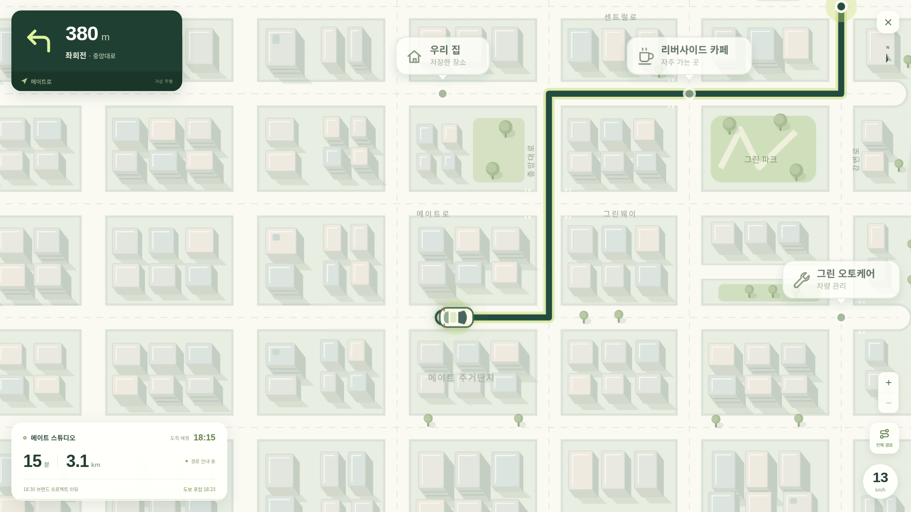
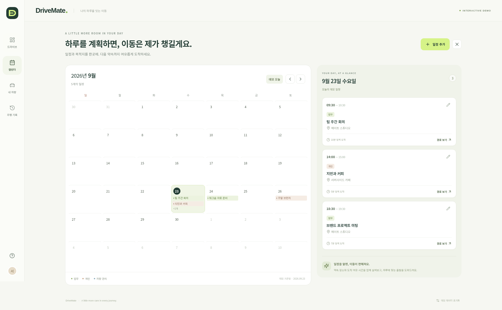

📱 **안드로이드 사용자라면 [여기를 눌러 DriveMate APK 바로 다운로드](https://github.com/studyreadbook4ever/myChangGo/releases/download/drivemate-v1.1.0/DriveMate-demo.apk)** — 설치하고 **주행 시작**을 누르면 전체 화면 내비게이션으로 전환됩니다.

# DriveMate

**차량과 일정, 나의 이동 습관을 연결하는 Personal Mobility AI Agent의 인터랙티브 목업.**

지도 속 작은 도시에서 출발을 추천받고 **주행 시작**을 누르면, 지도·방향 안내·도착 정보를 중심으로 한 전체 화면 내비게이션이 열립니다. 이동 중 정체를 만나면 우회하거나 현재 경로를 유지할 수 있습니다. 자체 캘린더를 편집하면 추천 출발시각도 바뀝니다. 실제 지도·GPS·Google Calendar·LLM·백엔드 없이 실행되는 발표용 프론트엔드입니다.

[발표용 시연 영상 MP4 다운로드](https://github.com/studyreadbook4ever/myChangGo/releases/download/drivemate-v1.1.0/DriveMate-demo.mp4) · [APK·영상 릴리스](https://github.com/studyreadbook4ever/myChangGo/releases/tag/drivemate-v1.1.0) · [발표 순서와 대본](docs/DEMO_SCRIPT.md)



## 폰으로 실행하기

1. 맨 위의 APK 링크를 안드로이드 폰에서 엽니다.
2. 다운로드한 `DriveMate-demo.apk`를 열어 설치합니다. 기기에서 요청하면 사용 중인 브라우저/파일 앱의 **이 출처의 앱 설치 허용**을 켭니다.
3. **DriveMate → 주행 시작**을 누릅니다. 설치 후에는 인터넷 없이 지도·한글 폰트·일정·애니메이션이 작동합니다.

Android 8.0 이상, 업데이트된 Android System WebView를 사용하세요. 시연용 debug 서명 APK이며 앱스토어 배포본은 아닙니다. 인터넷·위치·외부 캘린더 권한을 요청하지 않습니다. 편집한 데이터는 현재 기기에만 저장되며 앱 삭제 또는 **데모 데이터 초기화**로 초기 상태로 돌아갑니다.

## 직접 눌러볼 수 있는 기능

| 화면            | 시연되는 동작                                                                                    |
| --------------- | ------------------------------------------------------------------------------------------------ |
| 드라이브        | 약 5km 규모의 가상 도시, 4개 목적지 선택, 출발 추천과 일정 여유 확인                             |
| 주행 내비게이션 | 전체 화면 지도, 진행 방향, 남은 거리·시간·도착 예정, 정체 시 우회 또는 현재 경로 유지, 도착 안내 |
| 내장 캘린더     | 월·날짜 이동, 일정 추가/수정/삭제, 목적지와 도착 여유시간 설정, 일정에서 경로 보기               |
| DriveMate 패널  | 일정·과거 운전 오차·주차·도보를 근거로 출발 추천, 지각 위험 설명, 우회 제안, 질문 버튼           |
| 내 차량         | 주행거리 수정, 주행 종료 후 거리 누적, 엔진오일 점검 잔여거리, 빈 시간 확인 후 정비 일정 추가    |
| 주행 기록       | 기본 예상과 주행 시간 비교, 누적 기록, 목적지별 평소 운전 보정                                   |
| 주차 기억       | 마지막 도착 지점을 저장하고 지도에서 다시 확인                                                   |

**주행 중에는 내비게이션에 집중합니다.** 사이드 메뉴와 추천 대시보드는 숨겨지고 지도와 방향·도착 정보가 화면을 채웁니다. **안내 종료**를 누르면 종료 여부를 확인하며, 도중에 종료한 이동은 완료 기록에 추가하지 않습니다. 목적지에 도착하면 **주행 마치기**로 대시보드에 돌아옵니다.

**캘린더가 개인화의 입력입니다.** `브랜드 프로젝트 미팅`의 시간·목적지·도착 여유시간을 바꾸고 **경로 보기**를 눌러보세요. 새 설정으로 출발 추천이 계산됩니다. 일정이 없는 장소는 약속을 가정하지 않고 이동 예상만 보여줍니다.



## 시연 수치

기준 날짜는 **2026-09-23**, 기본 일정은 **18:30 메이트 스튜디오 미팅**입니다. 미래 일정을 선택하면 해당 날짜의 계획을 미리 봅니다.

```text
기본 주행 12분 + 같은 목적지의 평소 운전 보정 3분
+ 주차 5분 + 도보 3분 + 원하는 여유 7분
= 약속 30분 전인 18:00 출발 권장

18:00 출발 → 약속 장소 도착 18:23 → 여유 7분
정체 +12분 → 현재 경로 유지 시 약속 장소 도착 18:35 → 지각 5분
우회로 9분 절약 → 도착 18:26 → 여유 4분

우회 주행 3.8km 종료 → 9,840km에서 9,843.8km로 증가
우회 주행 시간 18분 + 주차·도보 8분 = 약속 장소 도착까지 26분
현재 경로 유지 시 주행 27분, 거리 3.2km
```

개인화 보정은 같은 목적지의 최근 정상 주행 최대 10회에서 `(주행 시간 − 기본 예상)`의 중앙값을 사용합니다. 돌발 정체를 겪은 기록은 우회 여부와 관계없이 평소 운전 패턴 계산에서 제외합니다. 기록이 없는 목적지는 보정 0분으로 시작합니다.

도로 모양과 거리·시간은 시나리오를 위해 정한 가상 데이터입니다. 거리 값은 SVG 픽셀 길이에서 계산하지 않습니다. 날씨도 고정 예시이며 실제 교통·위치·차량 센서·자유 대화 AI·정비 예약은 연결되어 있지 않습니다. AI 문장은 상태와 계산 결과를 이용한 설명 템플릿입니다.

## 웹에서 개발·실행

Node.js 22.12 이상과 npm이 필요합니다.

```bash
cd 260923CarMockUp
npm ci
npm run dev
```

터미널에 표시되는 주소를 브라우저에서 엽니다. 프로젝트는 React + TypeScript + Vite이며, 지도는 직접 작성한 SVG입니다. 한글 폰트도 번들에 포함합니다.

```bash
npm test             # 출발시간·개인화·일정 충돌·저장값 복구 계산 검증
npm run test:e2e     # Chromium에서 일정 편집·주행 안내·모바일·영속성 검증
npm run build       # TypeScript 검사와 정적 빌드
```

E2E 기본 Chromium 경로는 `/usr/bin/chromium`입니다. 다른 환경은 `CHROMIUM_PATH=/path/to/chromium npm run test:e2e`로 지정하세요.

## APK를 다시 만들기

[Android 빌드 안내](android/README.md)에 SDK와 서명 설명이 있습니다.

```bash
export ANDROID_HOME=/path/to/Android/Sdk
npm run build:apk
# downloads/DriveMate-demo.apk 생성
```

웹 빌드 결과를 Android 앱 내부에 넣어 실행합니다. WebViewAssetLoader의 로컬 HTTPS 주소로 읽으며 외부 네트워크 요청을 차단합니다. 서명키·SDK 경로·생성된 웹 에셋은 저장소에 포함하지 않습니다. 다른 PC의 debug 키로 만든 APK를 설치할 때에는 기존 설치본을 지워야 할 수 있습니다.

## 영상 다시 만들기

Chromium과 FFmpeg가 있는 환경에서 다음 명령을 사용합니다. 1080p 무음 MP4와 발표용 스크린샷을 생성합니다.

```bash
npm run dev -- --port 4173
# 다른 터미널에서
node scripts/record-demo.mjs
```

출력: `docs/DriveMate-demo.mp4`, `docs/presentation.png`, `docs/desktop.png`, `docs/calendar.png`, `docs/mobile.png`, `docs/mobile-navigation.png`. 영상은 GitHub 릴리스에 첨부하며 Git에는 원본 코드와 스크린샷을 보관합니다.

## 코드 위치

```text
src/App.tsx                  대시보드, 전체 화면 주행 안내, 차량·기록·추천 연결
src/model.ts                 예시 데이터, 출발 계산, 개인화, 정비 시간, 저장값 검사
src/components/CityMap.tsx   가상 도시, 차량 추적 카메라와 경로별 방향 안내
src/components/NavigationView.tsx  전체 화면 내비게이션, 경로 선택과 도착 요약
src/components/NavigationView.css  세로·가로 주행 화면 스타일
src/components/Calendar.tsx  자체 캘린더와 일정 편집
src/styles.css              반응형 대시보드, 차량·주행 기록 화면
android/                    오프라인 Android 앱
tests/                      계산 및 브라우저 회귀 검증
scripts/                    APK 빌드·시연 영상 생성
```

검증 결과는 [검증 기록](docs/VERIFICATION.md)에 정리했습니다. 번들 라이브러리 고지는 [THIRD_PARTY_NOTICES.md](THIRD_PARTY_NOTICES.md)를 참고하세요.
