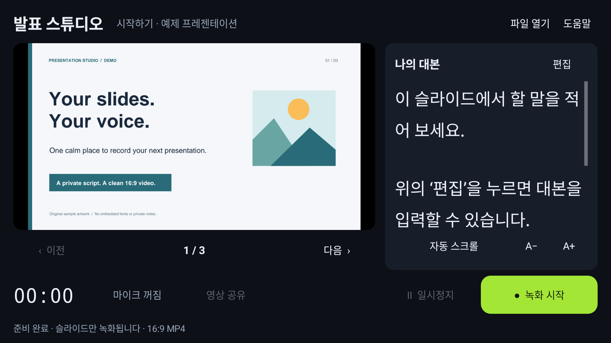

[📥 APK 다운로드 · 발표 스튜디오 1.0.0](https://github.com/studyreadbook4ever/myChangGo/releases/download/presentation-v1.0.0/presentation-studio-1.0.0.apk)

# 발표 스튜디오

PDF를 넘기며 대본을 읽고, 슬라이드와 목소리만 16:9 영상으로 저장하는 Kotlin Android 앱입니다.
`myChangGo/260927presentation` 안에 소스와 테스트를 함께 보관합니다.



## 휴대폰에서 시작하기

1. 맨 위 APK 링크를 휴대폰에서 열어 설치합니다. 필요한 경우 해당 브라우저의 **출처를 알 수 없는 앱 설치**를 허용합니다.
2. PowerPoint 자료는 **다른 이름으로 저장 → PDF**로 내보냅니다. 일반 PDF도 사용할 수 있습니다.
3. 앱을 열고 **파일 열기**에서 PDF를 선택합니다. 처음에는 예제 PDF가 표시됩니다.
4. 오른쪽 **나의 대본 → 편집**에서 페이지별 대본을 작성합니다.
5. **녹화 시작**을 누르고 발표합니다. 필요하면 일시정지·재개하고, **녹화 종료**로 저장합니다.
6. 전용 기본 저장 폴더 `Movies/PresentationStudio`에서 MP4를 확인하거나 **영상 공유**를 누릅니다. 이 폴더의 영상은 앱을 삭제해도 남습니다.

Android 10 이상에서 설치할 수 있습니다. 카메라는 사용하지 않습니다. 음성을 넣으려면 처음 한 번 마이크 권한을 허용하고, 원하지 않으면 마이크를 끄세요.

## 기능

- 왼쪽의 큰 16:9 미리보기와 이전/다음 페이지 버튼
- 오른쪽 페이지별 대본, 글자 크기 조절, 자동 스크롤
- PDF 내용에 따른 대본 저장: 이름을 바꿔도 같은 내용이면 대본 유지
- 마지막 문서·페이지 복원
- 1280×720 H.264 MP4, 선택적 AAC 마이크 음성
- 일시정지 시간을 제외하고 같은 영상에 이어서 녹화
- 앱 전환·화면 잠금 시 녹화 종료 및 저장
- 갤러리 저장 실패 시 앱 내부 원본을 보관하고 다음 실행 때 재시도
- 인터넷·계정·클라우드 변환·서버 업로드 없이 기기 안에서 동작

대본, 버튼, 녹화 시간, 휴대폰 알림은 영상에 들어가지 않습니다. 화면 전체를 캡처하지 않고 PDF 페이지 이미지 자체를 영상 인코더에 전달합니다.

## PDF 호환성

가로·세로·4:3·혼합 크기 등 일반 PDF의 정적 페이지를 Android의 PDF 엔진으로 표시합니다. 원래 비율을 유지하고 16:9 영상의 남는 영역은 검게 채웁니다. 폰트가 포함된 PDF는 별도의 폰트 파일을 앱에 넣을 필요가 없습니다.

- 입력: 최대 100 MB PDF. PPT/PPTX 직접 입력은 지원하지 않습니다.
- 암호가 필요한 PDF는 암호를 해제한 사본으로 저장한 뒤 열어 주세요.
- PDF의 링크, 동영상, 애니메이션, 대화형 폼 편집은 녹화 대상이 아닙니다.
- 손상 파일, 지원되지 않는 보안 방식, 기기의 PDF 엔진 차이는 오류 또는 표시 차이를 만들 수 있습니다.
- 기본 출력은 720p/24fps이며 기기에 따라 15fps를 선택합니다. 실제 인코딩 속도는 기기 성능에 영향을 받습니다.

세부 사항: [호환성](docs/COMPATIBILITY.md), [테스트 결과](docs/TEST_RESULTS.md), [테스트 방법](docs/TESTING.md).

## 빌드와 테스트

Android Studio에서 이 폴더를 열거나 JDK 17 이상, Android SDK 35 및 Build Tools 34.0.0을 준비합니다.

```sh
./gradlew assembleDebug testDebugUnitTest lintDebug
# USB 디버깅 기기 또는 Android 에뮬레이터 연결 후
./gradlew connectedDebugAndroidTest
python3 -m unittest discover -s tools -p 'test_*.py'
python3 tools/generate_fixtures.py --check
```

디버그 APK: `app/build/outputs/apk/debug/app-debug.apk`.
릴리스 APK에는 디버그 서명과 다른 전용 배포 서명을 사용합니다. 두 빌드 사이를 전환하려면 기존 앱을 삭제해야 할 수 있으며, 삭제하면 내부 대본이 사라집니다.

자체 릴리스 빌드는 `PRESENTATION_KEYSTORE`, `PRESENTATION_STORE_PASSWORD`, `PRESENTATION_KEY_PASSWORD` 환경 변수를 지정하고 `./gradlew assembleRelease`를 실행합니다. 키 별칭은 `presentation`입니다. 비밀키와 비밀번호는 저장소에 포함하지 않습니다.

## 구조와 라이선스

- `MainActivity.kt`: 발표 화면, 대본, 권한 및 수명주기
- `Documents.kt`: PDF 가져오기·비율 유지 렌더링·파일 검증
- `recording/`: EGL과 Android MediaRecorder를 통한 영상·음성 인코딩
- `VideoStore.kt`: MediaStore 갤러리 저장
- `samples/`: 직접 만든 PDF 예제와 오류 재현 파일
- `app/src/test`, `app/src/androidTest`: 시간 계산·PDF·녹화·화면 통합 테스트

앱 코드는 [MIT](LICENSE)입니다. Kotlin 및 포함된 코드의 라이선스와 고지는 [THIRD_PARTY_NOTICES.md](THIRD_PARTY_NOTICES.md)와 앱 내 **도움말 → 라이선스**에서 확인할 수 있습니다. 상용 PDF SDK나 Office 엔진, 외부 템플릿, 폰트 파일을 APK에 묶지 않았습니다. 사용자가 가져온 문서의 저작권은 해당 권리자에게 있습니다.
